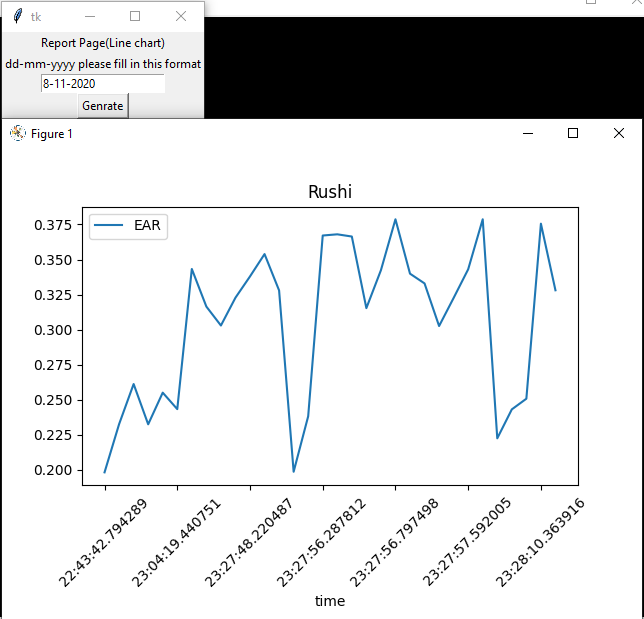

# Driver_drowsiness_with_face_recognition
# How to use
<ol>
<li>Install all packages.</li>
<li>Run GUI_DD.py file(python GUI_DD.py).</li>
<li>Click on start button(for capture the frames from webcam).</li>
<li>Click on stop button to stop frames.</li>
<li>Click on Bar chart button.
<ul>
    <li>Fill the date and view the bar chart.</li>
</ul>
</li>
<li>Click on Line chart button.
<ul>
    <li>Fill the date and view the bar chart.</li>
</ul>
</li>
</ol>

# Screenshots

